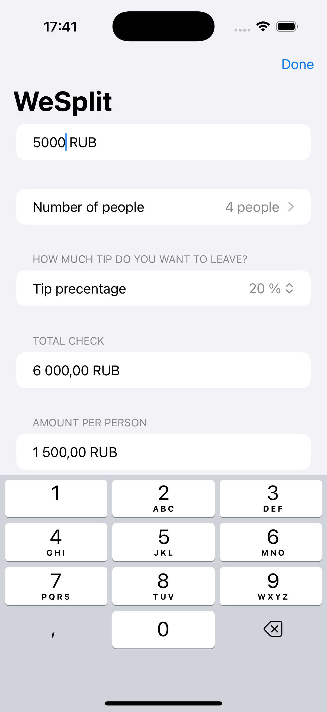

# WeSplit

WeSplit — это простое и интуитивно понятное приложение, разработанное для помощи пользователям в разделении расходов между друзьями или участниками группы. Этот проект особенно полезен для управления затратами во время мероприятий, таких как ужины, поездки или любые совместные активности, где расходы необходимо делить справедливо.



## Возможности

- **Удобный интерфейс**: Приложение предлагает чистый и понятный интерфейс, который упрощает ввод расходов и позволяет увидеть, сколько каждый должен.

- **Гибкий ввод расходов**: Пользователи могут быстро добавлять расходы, указывать, кто оплатил, и обозначать, сколько человек должны разделить стоимость.

- **Расчет в реальном времени**: При вводе расходов приложение автоматически рассчитывает сумму, которую должен каждый участник, обеспечивая прозрачность и точность.

- **Поддержка нескольких валют**: WeSplit позволяет пользователям вводить расходы в разных валютах, что делает его подходящим для международных поездок.

## Установка

Чтобы начать работу с WeSplit, клонируйте репозиторий и откройте проект в Xcode. Следуйте этим шагам:

1. Клонируйте репозиторий:
   ```bash
   git clone https://github.com/Serge-17/WeSplit.git


## 👨‍💻 Автор

**Serge Eliseev**
- GitHub: [@Serge-17](https://github.com/Serge-17)
